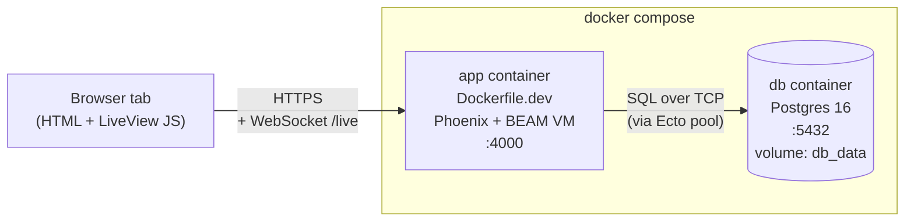
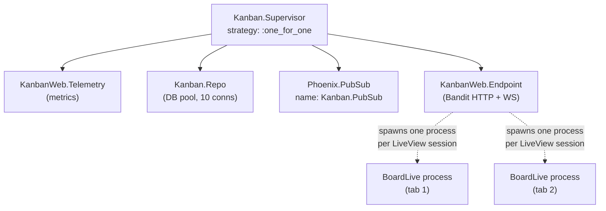
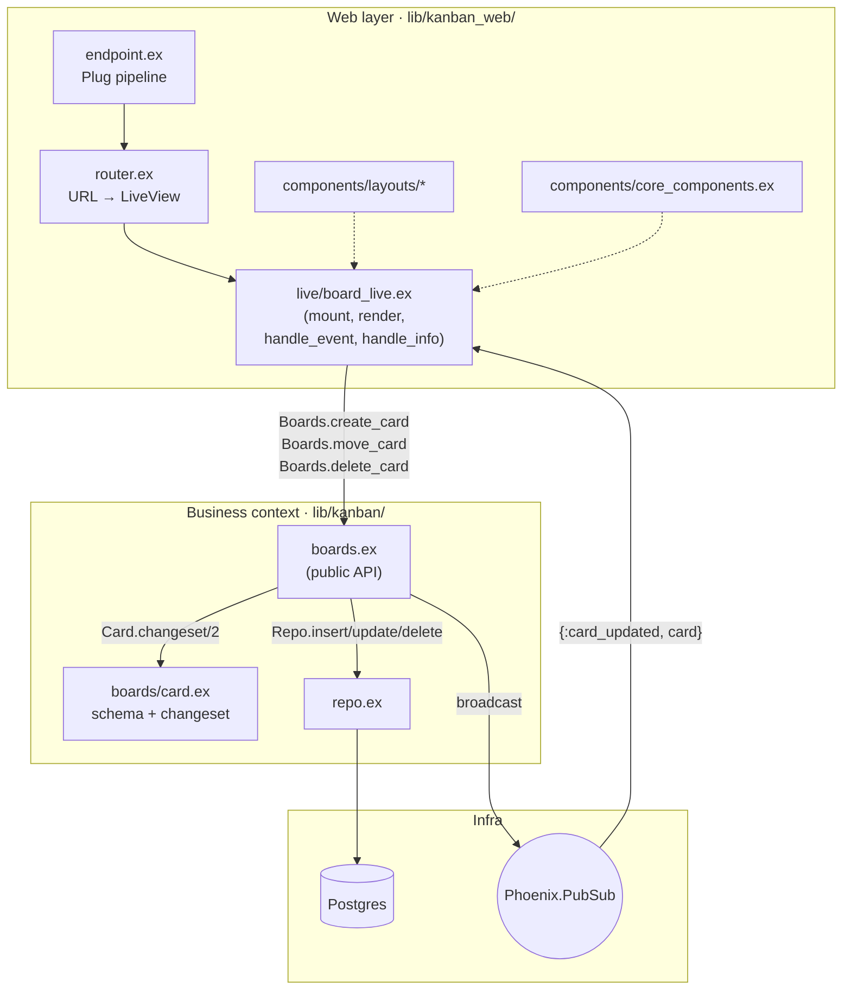
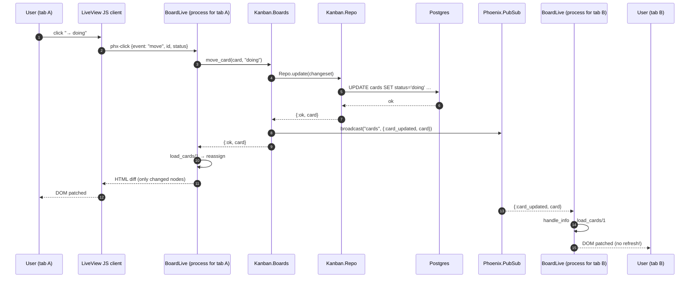
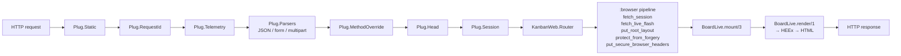

# Kanban — A Tiny Phoenix LiveView App for Python Developers

A minimal Kanban board (To Do / Doing / Done) built with **Elixir**, **Phoenix
LiveView**, **Ecto**, and **Postgres**. Every Elixir file is heavily annotated
with comments comparing the concepts to **Python** equivalents so you can pick
up the ideas without leaving familiar mental models behind.

## Running it

```bash
docker compose up --build
```

Then open <http://localhost:4000>. The first start runs migrations and seeds
four example cards.

> The compose file uses `Dockerfile.dev` for an iteration-friendly setup
> (source bind-mounted, hot reload). The root `Dockerfile` builds a slim
> production release.

## Where to start reading (suggested order)

If you've never touched Elixir or Phoenix before, read the files in this order.
Each step builds on the previous and the comments will introduce one new
concept at a time.

### Step 1 — How it runs (Docker first, then the BEAM)

1. **`docker-compose.yml`** — two services: `db` (Postgres 16) and `app`
   (our Phoenix server). The `app` service `depends_on` the DB's healthcheck,
   so the DB is fully up before Phoenix tries to connect. Bind-mounted source
   gives you hot reload. Read this top-to-bottom first.
2. **`Dockerfile.dev`** — what the `app` service builds. A single-stage image
   that installs Elixir + Erlang, fetches deps, then runs
   `mix ecto.create && mix ecto.migrate && mix run priv/repo/seeds.exs && mix phx.server`.
   Compare to a typical Python dev Dockerfile (apt install python3 → pip
   install → flask run): same shape, different tools.
3. **`Dockerfile`** *(production, optional reading)* — two-stage build that
   produces a self-contained OTP release. Stage 1 compiles everything, stage 2
   copies just the release into a slim Debian image. The Python analogue is a
   multi-stage PyInstaller / `pip install --target` build.

### Step 2 — How the app boots (Elixir/OTP)

4. **`mix.exs`** — project + dependencies (the `deps/0` function). Like
   `pyproject.toml` or `requirements.txt` plus the entry-point spec.
5. **`config/config.exs`** — base config loaded at compile time. Then
   **`config/dev.exs`** is merged on top (it sets DB credentials, port 4000,
   live reload). **`config/runtime.exs`** runs at *boot* and reads env vars.
6. **`lib/kanban/application.ex`** — the *supervision tree*. This is the
   entrypoint the BEAM calls when the app starts. Notice the `children` list:
   Telemetry, Repo, PubSub, Endpoint — they boot in that order.
   The closest Python analogue is the import-time setup in a Django `apps.py`
   plus a Celery worker definition, all in one place.

### Step 3 — The business domain (no web stuff yet)

7. **`lib/kanban/repo.ex`** — the database session (like SQLAlchemy's
   `Session`). Tiny module on purpose: it just wires up the adapter.
8. **`lib/kanban/boards/card.ex`** — the `Card` schema (DB table + struct)
   and the `changeset/2` function that validates incoming params.
9. **`lib/kanban/boards.ex`** — the *context*: the only place the web layer
   is allowed to call. Read this top to bottom — it has examples of pipes,
   pattern matching, `Enum.reduce`, PubSub broadcast, and the `{:ok, _}` /
   `{:error, _}` convention all in one file.
10. **`priv/repo/migrations/20260512000000_create_cards.exs`** — the SQL
    migration for the `cards` table. Mirrors Django/Alembic migrations.
11. **`priv/repo/seeds.exs`** — sample data inserted on first boot.

### Step 4 — The web layer (HTTP + WebSocket)

12. **`lib/kanban_web.ex`** — a "macro hub". Every web file starts with
    `use KanbanWeb, :live_view` (or `:html`, `:router`, …) and this module
    decides what that expands to. Read it once; you won't touch it often.
13. **`lib/kanban_web/endpoint.ex`** — the HTTP entrypoint. A pipeline of
    `plug` calls (sessions, static files, parsers, router). Compare to a
    Django middleware stack.
14. **`lib/kanban_web/router.ex`** — URL routes. We have exactly one:
    `live "/", BoardLive, :index`.
15. **`lib/kanban_web/components/layouts.ex`** + its `.heex` templates —
    the HTML skeleton wrapped around every page. HEEx is Phoenix's template
    language (think Jinja2 with compile-time validation).
16. **`lib/kanban_web/components/core_components.ex`** — reusable
    `button` / `input` / `flash` function components. React-style props
    (called *attrs*) with type checks.
17. **`lib/kanban_web/live/board_live.ex`** — **the interesting file**.
    A LiveView is a long-running server process that owns one browser tab's
    state. Read `mount/3` → `render/1` → the `handle_event/3` clauses →
    `handle_info/2`. This single file replaces what you'd write as
    Django view + JavaScript + WebSocket handler.

### Step 5 — Assets (small)

18. **`assets/js/app.js`** — boots the LiveView client. ~10 lines.
19. **`assets/css/app.css`** + **`assets/tailwind.config.js`** — Tailwind
    sources. Compiled by the `tailwind` Mix task (no Node required).

### Step 6 — Misc

20. **`lib/kanban_web/telemetry.ex`** — runtime metrics scaffolding.
21. **`lib/kanban_web/controllers/error_html.ex` / `error_json.ex`** —
    404/500 renderers.
22. **`.formatter.exs`** — config for `mix format` (Elixir's `black`).

## Starting the app — step by step

The minimum:

```bash
docker compose up --build
```

What happens, in order:

1. **Postgres starts** (`db` service) and the healthcheck waits until
   `pg_isready` succeeds.
2. **The `app` image is built** from `Dockerfile.dev` if not cached.
3. **Inside the container**, the CMD runs:
   - `mix ecto.create` — creates the `kanban_dev` database.
   - `mix ecto.migrate` — applies the `cards` table migration.
   - `mix run priv/repo/seeds.exs` — inserts four sample cards (idempotent).
   - `mix phx.server` — boots the supervision tree and starts Bandit on
     port 4000.
4. **Tailwind + esbuild** auto-install their binaries on first run
   (configured as dev watchers in `config/dev.exs`).
5. Visit <http://localhost:4000>. Open two tabs side-by-side and add/move/
   delete cards in one tab — the other updates in real time via PubSub.

### Useful follow-up commands

```bash
# Tail logs
docker compose logs -f app

# Open an IEx (Elixir REPL) inside the running container
docker compose exec app iex --sname console -S mix

# Reset the DB
docker compose exec app mix ecto.reset

# Rebuild after Dockerfile.dev / mix.exs changes
docker compose up --build

# Stop everything but keep the DB volume
docker compose down

# Stop everything AND wipe the DB volume
docker compose down -v
```

### Without Docker

You need Elixir 1.15+, Erlang/OTP 26, and Postgres running locally.

```bash
mix setup           # deps.get + ecto.create + ecto.migrate + seeds + assets.build
mix phx.server      # http://localhost:4000
```

## How the app works — diagrams

### 1. Deployment view (what Docker brings up)



### 2. Supervision tree (what the BEAM starts inside the app container)

`Kanban.Application.start/2` boots this tree. If any child crashes, only that
child is restarted (`:one_for_one`). Think of it as systemd-for-processes,
built into the runtime.



### 3. Layered code map (where to look for what)



### 4. End-to-end: clicking "→ doing" on a card

This is what happens when a user clicks the move button. Notice there is
*no JavaScript you wrote* in this flow — LiveView ships the diff over
WebSocket and patches the DOM.



### 5. Request lifecycle through `Endpoint` plugs

A regular HTTP request to `/` walks through this Plug pipeline before
reaching the LiveView's `mount/3`. Each `plug` is conceptually one piece of
Django/Flask middleware.



## Concept tour (Python ↔ Elixir)

| Python idea                         | Elixir/Phoenix counterpart                  | Where to look |
|-------------------------------------|---------------------------------------------|----|
| `class` (namespace)                 | `defmodule`                                 | every `.ex` file |
| `def`                               | `def` / `defp` (private)                    | `lib/kanban/boards.ex` |
| `@staticmethod` / `singledispatch`  | Pattern-matched function clauses            | `lib/kanban/boards.ex`, `core_components.ex` |
| `functools.reduce`                  | `Enum.reduce/3`                             | `lib/kanban/boards.ex` |
| `dict`                              | `Map` (`%{key: value}`)                     | everywhere |
| `Enum` / interned strings           | Atoms (`:ok`, `:error`)                     | everywhere |
| Pydantic validation                 | Ecto Changesets                             | `lib/kanban/boards/card.ex` |
| SQLAlchemy `Session`                | `Ecto.Repo`                                 | `lib/kanban/repo.ex` |
| Django app `services.py`            | A Phoenix "context"                         | `lib/kanban/boards.ex` |
| ABC / Protocol                      | A behaviour (`use Application`, etc.)       | `lib/kanban/application.ex` |
| Decorators / mixins                 | `use Module` (compile-time code injection)  | `lib/kanban_web.ex` |
| `from x import y`                   | `alias` / `import`                          | top of most files |
| Celery worker tree                  | OTP supervision tree                        | `lib/kanban/application.ex` |
| Django Channels + Redis             | `Phoenix.PubSub` (in-process)               | `lib/kanban/boards.ex` |
| `os.environ.get`                    | `System.get_env/2`                          | `config/runtime.exs` |
| HTMX / Hotwire                      | Phoenix **LiveView**                        | `lib/kanban_web/live/board_live.ex` |
| Jinja2 templates                    | HEEx (`~H""" """`)                          | LiveView + components |
| Alembic / Django migrations         | Ecto migrations                             | `priv/repo/migrations/` |
| pytest fixtures                     | `Ecto.Adapters.SQL.Sandbox`                 | `config/test.exs` |
| `black`                             | `mix format` (config in `.formatter.exs`)   | `.formatter.exs` |

### A few "feels different" things to look at

1. **Immutability everywhere.** `card = %{card | title: "new"}` does NOT
   mutate `card`; it builds a new map. There is no shared mutable state.
2. **The pipe operator (`|>`).** `data |> step1() |> step2()` reads
   left-to-right like a Unix pipeline. See `Boards.create_card/1`.
3. **Tagged tuples for results.** Almost every function returns
   `{:ok, value}` or `{:error, reason}`. Pattern matching on these tuples
   (`case ... do ... end`) replaces try/except as the default control flow
   for expected failures.
4. **Processes, not threads.** A LiveView is a server-side process that
   lives as long as the browser tab. PubSub messages between processes are
   how multiple tabs stay in sync (see `Boards.subscribe/0`).
5. **Macros and `use`.** When you see `use Phoenix.LiveView`, treat it as a
   "powerful mixin": it injects functions and callbacks at compile time.

## File tour

```
lib/
  kanban.ex                       # business root (docstring host)
  kanban/
    application.ex                # supervision tree — boot order
    repo.ex                       # Ecto repo (DB session)
    boards.ex                     # context: the public business API
    boards/card.ex                # schema + changeset (model + validation)
  kanban_web.ex                   # macro hub for use KanbanWeb, :live_view
  kanban_web/
    endpoint.ex                   # HTTP entry point (Plug pipeline)
    router.ex                     # URL routing
    telemetry.ex                  # metrics
    live/board_live.ex            # the LiveView itself
    components/                   # HEEx layouts & function components
    controllers/                  # JSON/HTML error renderers
priv/repo/
  migrations/                     # Ecto migrations
  seeds.exs                       # initial data
config/                           # env-specific config
assets/                           # CSS (Tailwind) + JS (LiveView client)
Dockerfile                        # production release image
Dockerfile.dev                    # dev image used by docker-compose
docker-compose.yml                # Postgres + app
```

## Running locally without Docker

You need Elixir 1.15+, Erlang/OTP 26, and Postgres.

```bash
mix setup           # fetch deps, create DB, migrate, seed, build assets
mix phx.server      # start the server at http://localhost:4000
```
